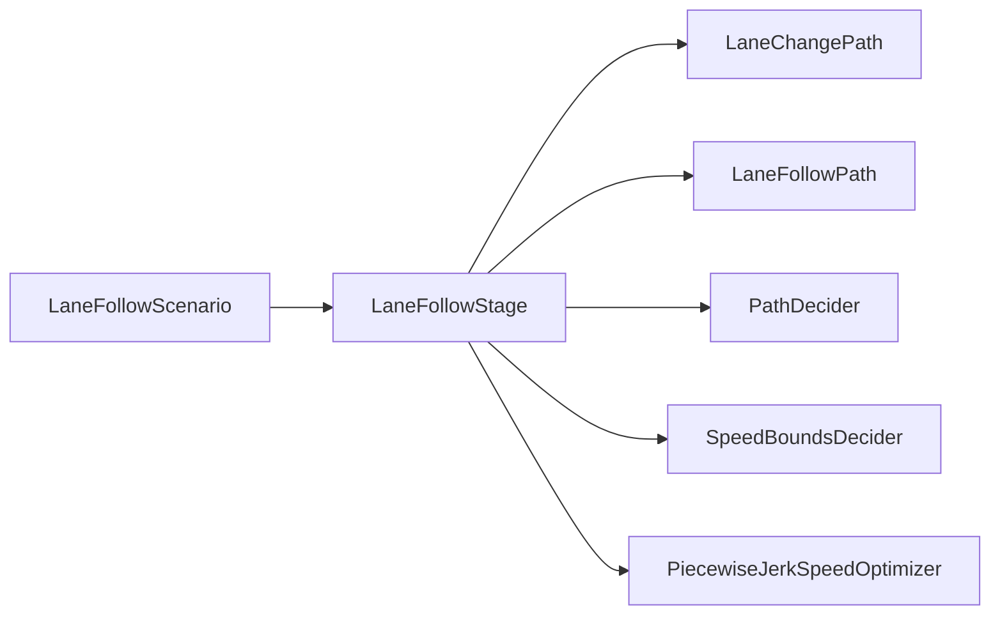

# 第 11 课：LaneFollow 场景

> 学生自学版。LaneFollow 是最常用、最适合作为新手入口的场景。

## 1. 学习信息

- 预计用时：100～130 分钟。
- 难度：核心。
- 前置：第 10 课。
- 代码基线：`d53aa3da47a06a08e6d0cd175d5623a34fa0d6aa`。

## 2. 学完本课应能做到

- [ ] 解释 LaneFollow 的作用。
- [ ] 阅读 `LaneFollowScenario::IsTransferable`。
- [ ] 找到 LaneFollow 的 pipeline 配置。
- [ ] 说出 LaneFollowStage 的主要职责。
- [ ] 理解 LaneFollow 为什么经常作为默认场景。

## 3. LaneFollow 是什么


LaneFollow 表示：

```text
车辆沿着路由路线继续行驶
在当前车道处理障碍物、路径和速度
没有进入停止牌、交通灯专用场景或泊车场景
```

它通常是默认场景。

## 4. 场景类定义

> 源码位置：`modules/planning/scenarios/lane_follow/lane_follow_scenario.h`，约第 33～50 行。

```cpp
// 源码位置：lane_follow_scenario.h，约第 33 行
class LaneFollowScenario : public Scenario {
 public:
  // LaneFollow 不使用特殊共享上下文，因此返回 nullptr
  ScenarioContext* GetContext() override { return nullptr; }

  // 判断是否可以从其他场景切换到 LaneFollow
  bool IsTransferable(const Scenario* other_scenario,
                      const Frame& frame) override;
};
```

继承关系：

```text
Scenario
  -> LaneFollowScenario
```

## 5. 切入条件

> 源码位置：`modules/planning/scenarios/lane_follow/lane_follow_scenario.cc`，约第 29～42 行。

```cpp
// 源码位置：lane_follow_scenario.cc，约第 29 行
bool LaneFollowScenario::IsTransferable(const Scenario* other_scenario,
                                        const Frame& frame) {
  // 必须有 lane_follow_command，说明存在沿路线行驶的导航命令
  if (!frame.local_view().planning_command->has_lane_follow_command()) {
    return false;
  }

  // 必须有参考线，否则无法沿车道规划
  if (frame.reference_line_info().empty()) {
    return false;
  }

  // 当前没有其他场景时，可以进入 LaneFollow
  if (other_scenario == nullptr) {
    return true;
  }

  // 对新手先理解为：满足基础条件后允许作为默认场景
  return true;
}
```

核心条件：

```text
有 LaneFollow 导航命令
有参考线信息
```

## 6. LaneFollow Stage

> 源码位置：`modules/planning/scenarios/lane_follow/lane_follow_stage.h`，约第 33～57 行。

```cpp
// 源码位置：lane_follow_stage.h，约第 33 行
class LaneFollowStage : public Stage {
 public:
  // 运行车道跟随阶段
  StageResult Process(const common::TrajectoryPoint& planning_init_point,
                      Frame* frame) override;

  // 在某条参考线上生成路径与速度
  StageResult PlanOnReferenceLine(
      const common::TrajectoryPoint& planning_start_point, Frame* frame,
      ReferenceLineInfo* reference_line_info);

  // 任务失败时生成回退轨迹
  void PlanFallbackTrajectory(
      const common::TrajectoryPoint& planning_start_point, Frame* frame,
      ReferenceLineInfo* reference_line_info);
};
```

## 7. Stage 的一轮处理

> 源码位置：`modules/planning/scenarios/lane_follow/lane_follow_stage.cc`，约第 82～134 行。

```cpp
// 源码位置：lane_follow_stage.cc，约第 82 行
StageResult LaneFollowStage::Process(
    const TrajectoryPoint& planning_start_point, Frame* frame) {
  // 没有参考线时，本阶段直接结束
  if (frame->reference_line_info().empty()) {
    return StageResult(StageStatusType::FINISHED);
  }

  // 依次尝试 Frame 中的参考线
  for (auto& reference_line_info : *frame->mutable_reference_line_info()) {
    // 在当前参考线上执行任务链
    result = PlanOnReferenceLine(planning_start_point, frame,
                                 &reference_line_info);

    // 如果路径和速度都成功，就认为找到了可行驶参考线
    if (!result.HasError()) {
      has_drivable_reference_line = true;
      continue;
    }
  }

  // 至少一条参考线可行驶，则 Stage 继续运行
  return has_drivable_reference_line
             ? result.SetStageStatus(StageStatusType::RUNNING)
             : result.SetStageStatus(StageStatusType::ERROR);
}
```

## 8. LaneFollow 的 Task 管道

> 源码位置：`modules/planning/scenarios/lane_follow/conf/pipeline.pb.txt`，第 1～47 行。

```text
# 源码位置：lane_follow/conf/pipeline.pb.txt
stage {
  name: "LANE_FOLLOW_STAGE"
  type: "LaneFollowStage"

  # 1. 变道路径
  task { name: "LANE_CHANGE_PATH"  type: "LaneChangePath" }
  # 2. 车道跟随路径
  task { name: "LANE_FOLLOW_PATH"  type: "LaneFollowPath" }
  # 3. 借道路径
  task { name: "LANE_BORROW_PATH"  type: "LaneBorrowPath" }
  # 4. 回退路径
  task { name: "FALLBACK_PATH"     type: "FallbackPath" }
  # 5. 路径决策
  task { name: "PATH_DECIDER"      type: "PathDecider" }

  # 6. 基础停车规则
  task { name: "RULE_BASED_STOP_DECIDER" type: "RuleBasedStopDecider" }
  # 7. 先计算速度边界
  task { name: "SPEED_BOUNDS_PRIORI_DECIDER" type: "SpeedBoundsDecider" }
  # 8. 生成速度启发信息
  task { name: "SPEED_HEURISTIC_OPTIMIZER" type: "PathTimeHeuristicOptimizer" }
  # 9. 速度决策
  task { name: "SPEED_DECIDER" type: "SpeedDecider" }
  # 10. 再计算最终速度边界
  task { name: "SPEED_BOUNDS_FINAL_DECIDER" type: "SpeedBoundsDecider" }
  # 11. 生成平滑速度曲线
  task { name: "PIECEWISE_JERK_SPEED" type: "PiecewiseJerkSpeedOptimizer" }
}
```

新手不要一次读完全部 Task。建议顺序：

```text
LaneFollowPath
  -> PathDecider
  -> SpeedBoundsDecider
  -> PiecewiseJerkSpeedOptimizer
```

## 9. 动手实验

```powershell
rg -n "class LaneFollowScenario|IsTransferable|GetContext" modules\planning\scenarios\lane_follow\lane_follow_scenario.h modules\planning\scenarios\lane_follow\lane_follow_scenario.cc
rg -n "class LaneFollowStage|Process|PlanOnReferenceLine|PlanFallbackTrajectory" modules\planning\scenarios\lane_follow\lane_follow_stage.h
Get-Content modules\planning\scenarios\lane_follow\conf\pipeline.pb.txt
```

画出：

```text
LaneFollowScenario
  -> LaneFollowStage
      -> LaneChangePath
      -> LaneFollowPath
      -> PathDecider
      -> ...
```

## 10. 常见错误

- 认为 LaneFollow 只会直行。
- 忽略它也会执行变道、借道和障碍物处理任务。
- 把 pipeline 中的 Task 顺序当作无关紧要。
- 认为只有进入特殊场景才需要 Task。
- 没有参考线时仍期待 LaneFollow 能正常生成轨迹。

## 11. 自测题

1. LaneFollow 代表什么驾驶状态？
2. 进入 LaneFollow 至少需要什么条件？
3. `GetContext()` 为什么返回 `nullptr`？
4. LaneFollowStage 为什么需要尝试多条参考线？
5. `PlanOnReferenceLine` 做什么？
6. pipeline 文件的作用是什么？
7. 哪一个 Task 负责车道跟随路径？
8. 路径之后第一类速度任务是什么？
9. 为什么新手先看 LaneFollow 场景？
10. LaneFollow 是否包含变道任务？

## 12. 参考答案

1. 沿路由和参考线继续行驶的默认场景。
2. 有 LaneFollow 命令和有参考线信息。
3. LaneFollow 不依赖专门的场景共享上下文。
4. 选择一条路径和速度都可行、代价可接受的参考线。
5. 在某条参考线上执行 LaneFollow 的 Task 链并生成轨迹。
6. 定义 Stage 及其包含的 Task 和执行顺序。
7. `LaneFollowPath`。
8. `SpeedBoundsDecider`。
9. 它是最常见、配置完整、结构清晰的默认场景。
10. 包含，例如 `LaneChangePath` 和 `LaneBorrowPath`。

## 13. 过关检查

- [ ] 能说明 LaneFollow 的切入条件。
- [ ] 能找到 LaneFollowStage。
- [ ] 能读懂 pipeline 顺序。
- [ ] 能画出场景到 Task 的关系图。
- [ ] 十道题至少答对八道。

## 14. 下一课衔接

下一课进入 Stage 和 Task 的执行细节，观察任务列表如何循环、失败如何终止、fallback 如何接管。