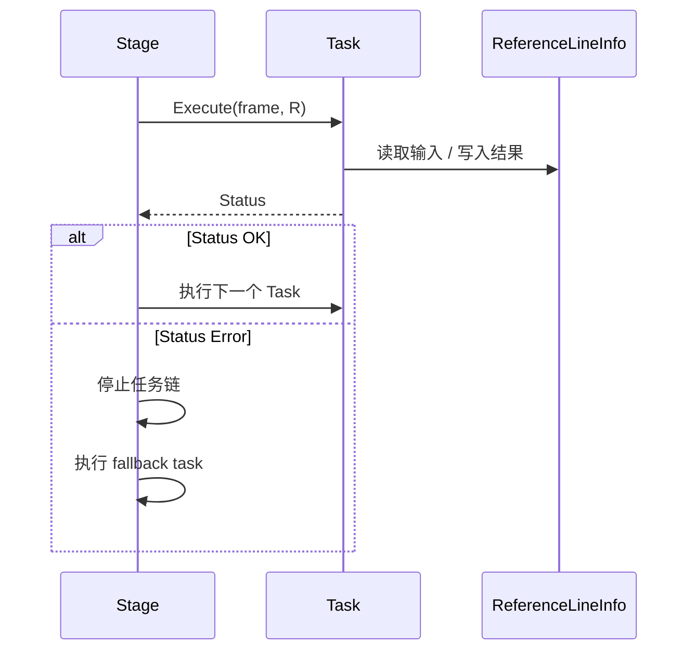

# 第 12 课：Stage 如何执行 Task

> 学生自学版。本课重点看任务循环、执行状态、失败中断和 fallback。

## 1. 学习信息

- 预计用时：100～130 分钟。
- 难度：核心。
- 前置：第 11 课。
- 代码基线：`d53aa3da47a06a08e6d0cd175d5623a34fa0d6aa`。

## 2. 学完本课应能做到

- [ ] 说明 Stage 和 Task 的职责边界。
- [ ] 读懂 `task_list_` 循环。
- [ ] 理解 `common::Status` 如何表示成功和失败。
- [ ] 解释 fallback task 的触发条件。
- [ ] 找到路径与速度轨迹的合并位置。

## 3. Stage 的核心循环


> 源码位置：`modules/planning/planning_interface_base/scenario_base/stage.cc`，约第 101～157 行。

```cpp
// 源码位置：stage.cc，约第 101 行
StageResult Stage::ExecuteTaskOnReferenceLine(
    const common::TrajectoryPoint& planning_start_point, Frame* frame) {
  // StageResult 保存本阶段的任务状态和场景状态
  StageResult stage_result;

  // 没有参考线，无法继续执行参考线上的任务
  if (frame->reference_line_info().empty()) {
    return stage_result.SetStageStatus(StageStatusType::ERROR);
  }

  // 逐个尝试 Frame 中的参考线
  for (auto& reference_line_info : *frame->mutable_reference_line_info()) {
    // 不可行驶的参考线直接跳过
    if (!reference_line_info.IsDrivable()) {
      reference_line_info.SetDrivable(false);
      continue;
    }

    // 变道参考线在本函数中先跳过
    if (reference_line_info.IsChangeLanePath()) {
      reference_line_info.SetDrivable(false);
      continue;
    }

    // 任务状态初始化为 OK
    common::Status ret = common::Status::OK();

    // 按 task_list_ 的配置顺序执行任务
    for (auto task : task_list_) {
      // 每个 Task 都接收同一个 Frame 和当前参考线信息
      ret = task->Execute(frame, &reference_line_info);

      // 如果某个 Task 失败，保留失败状态并跳出任务循环
      if (!ret.ok()) {
        stage_result.SetTaskStatus(ret);
        break;
      }
    }

    // 任何一个任务失败后，交由 fallback task 生成安全替代结果
    if (!ret.ok()) {
      fallback_task_->Execute(frame, &reference_line_info);
    }

    // 将路径 profile 和速度 profile 合并成离散轨迹
    DiscretizedTrajectory trajectory;
    if (!reference_line_info.CombinePathAndSpeedProfile(
            planning_start_point.relative_time(),
            planning_start_point.path_point().s(), &trajectory)) {
      reference_line_info.SetDrivable(false);
      continue;
    }

    // 轨迹生成成功，保存回 ReferenceLineInfo
    reference_line_info.SetTrajectory(trajectory);
    reference_line_info.SetDrivable(true);
    return stage_result;
  }

  return stage_result;
}
```

## 4. 为什么 Task 要按顺序执行

路径任务通常要先于速度任务：

```text
先知道车辆准备走哪条路径
再计算沿这条路径各时刻能跑多快
最后把路径和速度合并成轨迹
```

因此 pipeline 的顺序不是装饰信息，而是执行依赖。

## 5. Status 代表什么

Task 返回：

```cpp
common::Status
```

它可以表示：

- `Status::OK()`：成功。
- `PLANNING_ERROR`：规划失败。
- 失败原因文本：帮助日志定位。
- 其他错误码：具体模块定义的错误类型。

判断方式：

```cpp
if (!ret.ok()) {
  // 只要不是成功，就进入失败处理
}
```

## 6. fallback task

> 源码位置：`modules/planning/planning_interface_base/scenario_base/stage.h`，约第 86～88 行。

```cpp
// 源码位置：stage.h，约第 86 行
// 正常执行的任务列表
std::vector<std::shared_ptr<Task>> task_list_;

// 正常任务链失败时使用的安全替代任务
std::shared_ptr<Task> fallback_task_;
```

fallback 的目标不是“继续完成原任务”，而是：

```text
保证 Planning 尽量还能给控制模块一条安全轨迹
```

## 7. LaneFollowStage 的任务执行

> 源码位置：`modules/planning/scenarios/lane_follow/lane_follow_stage.cc`，约第 136～175 行。

```cpp
// 源码位置：lane_follow_stage.cc，约第 136 行
StageResult LaneFollowStage::PlanOnReferenceLine(
    const TrajectoryPoint& planning_start_point, Frame* frame,
    ReferenceLineInfo* reference_line_info) {
  StageResult ret;

  // 逐个执行当前 Stage 配置的 Task
  for (auto task : task_list_) {
    // 记录任务开始时间，用于统计 planning 性能
    const double start_timestamp = Clock::NowInSeconds();

    // 任务真正执行
    ret.SetTaskStatus(task->Execute(frame, reference_line_info));

    // 记录任务耗时
    const double end_timestamp = Clock::NowInSeconds();
    const double time_diff_ms = (end_timestamp - start_timestamp) * 1000;

    // 某个任务失败时终止当前任务链
    if (ret.IsTaskError()) {
      break;
    }
  }

  return ret;
}
```

LaneFollowStage 会记录每个 Task 的耗时，这对比赛调试和性能优化很重要。

## 8. 动手实验

```powershell
rg -n "for \(auto task : task_list_\)|task->Execute|fallback_task_|CombinePathAndSpeedProfile" modules\planning\planning_interface_base\scenario_base\stage.cc
rg -n "for \(auto task : task_list_\)|ret.IsTaskError|Clock::NowInSeconds" modules\planning\scenarios\lane_follow\lane_follow_stage.cc
```

绘制执行图：

```text
Stage
  -> Task A
  -> Task B
  -> Task C
  -> CombinePathAndSpeedProfile
```

## 9. 常见错误

- 以为所有 Task 失败后都会继续执行。
- 认为 fallback 是正常任务的一部分。
- 不检查返回状态。
- 混淆路径数据与最终轨迹。
- 忽略 Task 顺序导致的路径/速度依赖问题。

## 10. 自测题

1. Stage 负责什么？
2. Task 负责什么？
3. `task_list_` 中的任务如何执行？
4. Task 失败后循环如何处理？
5. fallback task 的作用是什么？
6. `common::Status` 可以保存哪些信息？
7. 路径和速度在哪里合并成轨迹？
8. 为什么记录每个 Task 的耗时？
9. `PlanOnReferenceLine` 返回什么？
10. 为什么不能先算速度再算路径？

## 11. 参考答案

1. 组织阶段流程、遍历任务、处理失败和生成 Stage 结果。
2. 完成具体路径、速度或决策工作。
3. 按配置顺序循环执行。
4. 记录失败状态并跳出任务循环，随后可能执行 fallback。
5. 生成安全替代结果，避免没有轨迹。
6. 成功/失败状态、错误码和错误信息。
7. `ReferenceLineInfo::CombinePathAndSpeedProfile`。
8. 用于性能分析，定位耗时 Task。
9. 返回 `StageResult`，包含任务状态和阶段状态。
10. 速度通常依赖路径长度和路径形状，必须先有路径。

## 12. 过关检查

- [ ] 能读懂 Stage 的任务循环。
- [ ] 能解释失败中断。
- [ ] 能定位路径速度合并。
- [ ] 能说明 fallback 的作用。
- [ ] 十道题至少答对八道。

## 13. 下一课衔接

下一课进入 Task 基类，观察 `Init` 和 `Execute` 的完整生命周期。