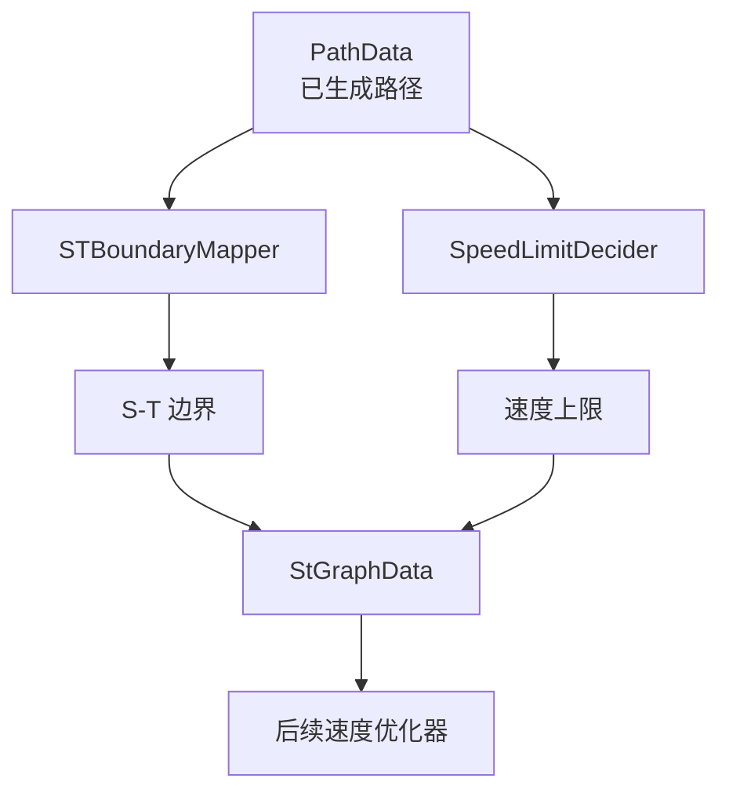

# 第 15 课：速度 Task 示例 SpeedBoundsDecider

> 学生自学版。重点学习 S-T 图、速度边界和路径/速度的分工。

## 1. 学习信息

- 预计用时：120～160 分钟。
- 难度：核心。
- 前置：第 14 课。
- 代码基线：`d53aa3da47a06a08e6d0cd175d5623a34fa0d6aa`。

## 2. 学完本课应能做到

- [ ] 说明 SpeedBoundsDecider 的输入和输出。
- [ ] 解释 S-T 图是什么。
- [ ] 区分路径边界和速度边界。
- [ ] 理解静态障碍物如何影响速度。
- [ ] 找到速度边界写入 StGraphData 的位置。

## 3. 类定义

> 源码位置：`modules/planning/tasks/speed_bounds_decider/speed_bounds_decider.h`，约第 32～51 行。

```cpp
// 源码位置：speed_bounds_decider.h，约第 32 行
class SpeedBoundsDecider : public Decider {
 public:
  bool Init(const std::string& config_dir, const std::string& name,
            const std::shared_ptr<DependencyInjector>& injector) override;

 private:
  common::Status Process(
      Frame* const frame,
      ReferenceLineInfo* const reference_line_info) override;

  double SetSpeedFallbackDistance(PathDecision* const path_decision);

  void RecordSTGraphDebug(
      const StGraphData& st_graph_data,
      planning_internal::STGraphDebug* st_graph_debug) const;

  SpeedBoundsDeciderConfig config_;
};
```

## 4. S-T 图的直觉


S-T 图：

```text
横轴：s，也就是沿路径行驶的距离
纵轴：t，也就是时间
```

障碍物在 S-T 图中的区域表示：

```text
在某个时间段内，车辆不能在某个 s 区间通过
```

速度规划必须避开这些不可通行的时空区域。

<figure class="lesson-illustration">
  
  <figcaption><strong>漫画图 5：</strong>车辆不仅要避开空间里的障碍物，还要避开 S-T 图中“某个时间不能进入某个位置”的禁区。</figcaption>
</figure>
## 5. Process 主流程

> 源码位置：`modules/planning/tasks/speed_bounds_decider/speed_bounds_decider.cc`，约第 53～110 行。

```cpp
// 源码位置：speed_bounds_decider.cc，约第 53 行
Status SpeedBoundsDecider::Process(
    Frame* const frame, ReferenceLineInfo* const reference_line_info) {
  // 取出已经生成好的路径数据
  const PathData& path_data = reference_line_info->path_data();

  // 取出规划起点
  const TrajectoryPoint& init_point = frame->PlanningStartPoint();

  // 取出参考线
  const ReferenceLine& reference_line = reference_line_info->reference_line();

  // 取出路径决策，后面会读取障碍物
  PathDecision* const path_decision = reference_line_info->path_decision();

  // 创建 S-T 边界映射器
  STBoundaryMapper boundary_mapper(
      config_, reference_line, path_data, path_data.discretized_path().Length(),
      config_.total_time(), injector_);

  // 把路径障碍物映射成 S-T 边界
  if (boundary_mapper.ComputeSTBoundary(path_decision).code() ==
      ErrorCode::PLANNING_ERROR) {
    return Status(ErrorCode::PLANNING_ERROR, "Mapping obstacle failed.");
  }

  // 创建速度限制计算器
  SpeedLimitDecider speed_limit_decider(config_, reference_line, path_data);

  // 计算参考线、道路和障碍物带来的速度上限
  SpeedLimit speed_limit;
  if (!speed_limit_decider
           .GetSpeedLimits(path_decision->obstacles(), &speed_limit)
           .ok()) {
    return Status(ErrorCode::PLANNING_ERROR, "Getting speed limits failed!");
  }

  return Status::OK();
}
```

## 6. 关键步骤

### 步骤一：创建 S-T 边界映射器

输入包括速度任务配置、参考线、路径、路径长度、时间范围和依赖注入器。

### 步骤二：映射障碍物

```cpp
boundary_mapper.ComputeSTBoundary(path_decision)
```

作用：

```text
把障碍物从空间中的位置转换成“什么时间不能到达什么 s 区间”
```

### 步骤三：计算速度限制

```cpp
SpeedLimitDecider::GetSpeedLimits(...)
```

会综合考虑道路限速、参考线曲率、障碍物和车辆动力学或任务配置。

### 步骤四：写回 StGraphData

> 源码位置：`modules/planning/tasks/speed_bounds_decider/speed_bounds_decider.cc`，约第 117～130 行。

```cpp
// 源码位置：speed_bounds_decider.cc，约第 117 行
StGraphData* st_graph_data = reference_line_info_->mutable_st_graph_data();

// 保存 S-T 边界和速度限制，供后续速度优化任务使用
st_graph_data->LoadData(boundaries, min_s_on_st_boundaries, init_point,
                        path_data, speed_limit, config_.total_time());
```

输出不是最终速度曲线，后面的优化器会在此基础上生成平滑速度曲线。

## 7. 路径任务和速度任务的分工

| 任务 | 主要回答 |
| --- | --- |
| LaneFollowPath | 车辆准备沿哪条路径走 |
| SpeedBoundsDecider | 哪些时空区域不能进入，速度上限是多少 |
| SpeedDecider | 每个位置目标速度怎样决策 |
| PiecewiseJerkSpeedOptimizer | 生成平滑、可执行的速度曲线 |

## 8. 动手实验

```powershell
rg -n "class SpeedBoundsDecider|Process\(|SetSpeedFallbackDistance|RecordSTGraphDebug" modules\planning\tasks\speed_bounds_decider\speed_bounds_decider.h
rg -n "SpeedBoundsDecider::Process|STBoundaryMapper|ComputeSTBoundary|GetSpeedLimits|mutable_st_graph_data|LoadData" modules\planning\tasks\speed_bounds_decider\speed_bounds_decider.cc
Get-Content modules\planning\tasks\speed_bounds_decider\README_cn.md
```

填写图：

```text
PathData + Obstacles
  -> ______________
  -> SpeedLimit
  -> StGraphData
  -> 后续速度优化
```

## 9. 常见错误

- 把 S-T 图当成普通 X-Y 地图。
- 认为速度任务重新生成路径。
- 认为 SpeedBoundsDecider 输出最终速度轨迹。
- 忽略路径长度对 S-T 映射的影响。
- 只读速度值，不读障碍物和边界。

## 10. 自测题

1. SpeedBoundsDecider 的直接父类是什么？
2. S-T 图的横轴和纵轴分别是什么？
3. 为什么必须先有路径？
4. `STBoundaryMapper` 做什么？
5. `SpeedLimitDecider` 计算什么？
6. 输出保存到哪个对象？
7. SpeedBoundsDecider 会生成最终速度曲线吗？
8. 速度边界对哪个后续任务最重要？
9. 静态障碍物为什么会影响速度？
10. 用一句话概括 SpeedBoundsDecider。

## 11. 参考答案

1. `Decider`。
2. 横轴是沿路径距离 s，纵轴是时间 t。
3. 因为 S 坐标和路径长度依赖已经生成好的路径。
4. 把路径上的障碍物转换成 S-T 图中的禁行边界。
5. 计算道路、参考线和障碍物等带来的速度上限。
6. `ReferenceLineInfo::mutable_st_graph_data()`。
7. 不会，它准备边界和限速，最终曲线由后续优化器生成。
8. `PiecewiseJerkSpeedOptimizer` 等速度优化任务。
9. 因为车辆必须减速、停车或等待，才能避免在错误时间进入障碍物区域。
10. 把路径和障碍物转换为 S-T 边界与速度限制，供后续速度优化使用。

## 12. 过关检查

- [ ] 能解释 S-T 图。
- [ ] 能画出速度任务输出。
- [ ] 能区分路径和速度任务。
- [ ] 十道题至少答对八道。

## 13. 下一课衔接

下一课比较 Task 与 TrafficRule，理解为什么交通灯、停止牌和人行横道更偏向全局规则插件。