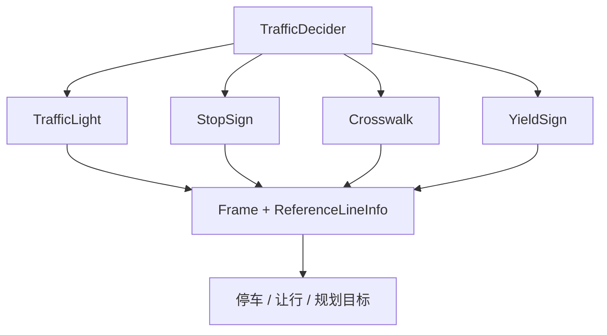

# 第 16 课：TrafficRule 与 Task 的区别

> 学生自学版。理解交通规则为什么单独成插件，以及它怎样影响路径和速度决策。

## 1. 学习信息

- 预计用时：100～140 分钟。
- 难度：核心。
- 前置：第 13 课。
- 代码基线：`d53aa3da47a06a08e6d0cd175d5623a34fa0d6aa`。

## 2. 学完本课应能做到

- [ ] 说出 TrafficRule 与 Task 的相同点和不同点。
- [ ] 阅读 TrafficRule 基类。
- [ ] 解释 TrafficDecider 怎样加载和执行规则。
- [ ] 以 TrafficLight 为例理解规则输出。
- [ ] 知道什么时候应该新增 Task，什么时候应该新增 TrafficRule。

## 3. 基本区别


| 项目 | Task | TrafficRule |
| --- | --- | --- |
| 组织位置 | Stage 的 pipeline | 全局 traffic rule pipeline |
| 执行时机 | Stage 任务链中 | 通常在 Plan 前统一执行 |
| 关注内容 | 某个阶段的具体计算 | 全局交通规则和停走决策 |
| 典型例子 | LaneFollowPath | TrafficLight、StopSign、Crosswalk |
| 配置入口 | `pipeline.pb.txt` | `traffic_rule_config.pb.txt` |

一句话：

```text
Task 更像“步骤”，TrafficRule 更像“所有场景都适用的规则”。
```

## 4. TrafficRule 基类

> 源码位置：`modules/planning/planning_interface_base/traffic_rules_base/traffic_rule.h`，约第 37～66 行。

```cpp
// 源码位置：traffic_rule.h，约第 37 行
class TrafficRule {
 public:
  TrafficRule();
  virtual ~TrafficRule() = default;

  // 初始化规则名称和依赖
  virtual bool Init(const std::string& name,
                    const std::shared_ptr<DependencyInjector>& injector);

  // 每个具体规则必须实现 ApplyRule
  virtual common::Status ApplyRule(
      Frame* const frame, ReferenceLineInfo* const reference_line_info) = 0;

  // 重置规则内部状态
  virtual void Reset() = 0;

 protected:
  // 读取规则配置文件
  template <typename T>
  bool LoadConfig(T* config);

  std::shared_ptr<DependencyInjector> injector_;
  std::string config_path_;
  std::string name_;
};
```

和 Task 一样：

- 有 `Init`。
- 依赖配置。
- 通过插件注册。

和 Task 不同：

- 核心接口叫 `ApplyRule`。
- 更强调对 Frame 和 ReferenceLineInfo 施加规则。
- 由 TrafficDecider 统一调度。

## 5. TrafficDecider 加载规则

> 源码位置：`modules/planning/planning_interface_base/traffic_rules_base/traffic_decider.cc`，约第 33～58 行。

```cpp
// 源码位置：traffic_decider.cc，约第 33 行
bool TrafficDecider::Init(const std::shared_ptr<DependencyInjector>& injector) {
  // 加载全局交通规则 pipeline 配置
  if (!apollo::cyber::common::LoadConfig(FLAGS_traffic_rule_config_filename,
                                         &rule_pipeline_)) {
    AERROR << "Load pipeline of Traffic decider failed!";
    return false;
  }

  // 按配置顺序创建每一个规则插件
  for (int i = 0; i < rule_pipeline_.rule_size(); i++) {
    auto rule = PluginManager::Instance()->CreateInstance<TrafficRule>(
        ConfigUtil::GetFullPlanningClassName(
            rule_pipeline_.rule(i).type()));

    // 初始化规则并加入执行列表
    rule->Init(rule_pipeline_.rule(i).name(), injector);
    rule_list_.push_back(rule);
  }

  return true;
}
```

配置文件：

> 源码位置：`modules/planning/planning_component/conf/traffic_rule_config.pb.txt`。

```text
# 源码位置：traffic_rule_config.pb.txt
rule {
  name: "CROSSWALK"
  type: "Crosswalk"
}
rule {
  name: "STOP_SIGN"
  type: "StopSign"
}
rule {
  name: "TRAFFIC_LIGHT"
  type: "TrafficLight"
}
```

## 6. TrafficDecider 执行规则

> 源码位置：`modules/planning/planning_interface_base/traffic_rules_base/traffic_decider.cc`，约第 98～116 行。

```cpp
// 源码位置：traffic_decider.cc，约第 98 行
Status TrafficDecider::Execute(Frame* frame,
                               ReferenceLineInfo* reference_line_info) {
  // 检查输入非空
  CHECK_NOTNULL(frame);
  CHECK_NOTNULL(reference_line_info);

  // 依次应用每个交通规则
  for (const auto& rule : rule_list_) {
    // 规则可以先清空自己的临时状态
    rule->Reset();

    // 规则读取 Frame 和参考线信息，产生交通决策
    rule->ApplyRule(frame, reference_line_info);
  }

  // 根据规则产生的停车决策构建规划目标
  BuildPlanningTarget(reference_line_info);
  return Status::OK();
}
```

## 7. TrafficLight 规则示例

> 源码位置：`modules/planning/traffic_rules/traffic_light/traffic_light.h`，约第 35～50 行。

```cpp
// 源码位置：traffic_light.h，约第 35 行
class TrafficLight : public TrafficRule {
 public:
  // 加载 TrafficLightConfig
  bool Init(const std::string& name,
            const std::shared_ptr<DependencyInjector>& injector) override;

  // 规则的核心执行函数
  common::Status ApplyRule(Frame* const frame,
                           ReferenceLineInfo* const reference_line_info);

  // TrafficLight 没有需要长期保留的临时状态
  void Reset() override {}

 private:
  TrafficLightConfig config_;

  // 根据地图和感知信号产生停走决策
  void MakeDecisions(Frame* const frame,
                     ReferenceLineInfo* const reference_line_info);

  static constexpr char const* TRAFFIC_LIGHT_VO_ID_PREFIX = "TL_";
};
```

执行：

> 源码位置：`modules/planning/traffic_rules/traffic_light/traffic_light.cc`，约第 51～56 行。

```cpp
// 源码位置：traffic_light.cc，约第 51 行
Status TrafficLight::ApplyRule(Frame* const frame,
                               ReferenceLineInfo* const reference_line_info) {
  // 进入交通灯决策计算
  MakeDecisions(frame, reference_line_info);

  return Status::OK();
}
```

规则的核心输出不是直接生成最终轨迹，而是向 `ReferenceLineInfo` 添加障碍物、停车点或路径决策。

## 8. 什么时候新增哪种插件

新增 Task：

- 只在某个 Stage 中执行。
- 主要做路径、速度或局部决策计算。
- 只影响当前阶段流水线。

新增 TrafficRule：

- 需要在所有场景中统一应用。
- 主要处理交通标志、停止线、交通灯等规则。
- 可能向多个 ReferenceLineInfo 写入停止或让行决策。

## 9. 动手实验

```powershell
rg -n "class TrafficRule|virtual bool Init|virtual common::Status ApplyRule|virtual void Reset" modules\planning\planning_interface_base\traffic_rules_base\traffic_rule.h
rg -n "TrafficDecider::Init|CreateInstance<TrafficRule>|TrafficDecider::Execute|rule->ApplyRule" modules\planning\planning_interface_base\traffic_rules_base\traffic_decider.cc
rg -n "class TrafficLight|ApplyRule|MakeDecisions" modules\planning\traffic_rules\traffic_light\traffic_light.h modules\planning\traffic_rules\traffic_light\traffic_light.cc
Get-Content modules\planning\planning_component\conf\traffic_rule_config.pb.txt
```

填写：

| 问题 | Task | TrafficRule |
| --- | --- | --- |
| 配置在哪里 |  |  |
| 核心执行函数 |  |  |
| 例子 |  |  |

## 10. 常见错误

- 认为 TrafficRule 和 Task 完全一样。
- 在 Task 中重复实现全局交通灯规则。
- 忘记在 TrafficRule pipeline 中注册新规则。
- 以为 TrafficRule 会直接发布轨迹。
- 把场景规则和全局规则混在一起。

## 11. 自测题

1. TrafficRule 的关注点是什么？
2. Task 的关注点是什么？
3. TrafficRule 的核心执行函数是什么？
4. TrafficDecider 为什么需要规则列表？
5. 交通规则来自哪个配置文件？
6. TrafficLight 的 `Reset` 为什么可以是空实现？
7. 交通规则产生的结果通常写入哪里？
8. 新增 Task 应配置在哪里？
9. 新增 TrafficRule 应配置在哪里？
10. 用一句话区分两者。

## 12. 参考答案

1. 全局交通规则和跨场景停走决策。
2. 某个 Stage 的具体计算步骤。
3. `ApplyRule`。
4. 统一加载、重置和执行多个规则插件。
5. `traffic_rule_config.pb.txt`。
6. 它不需要保留跨轮次临时状态。
7. 写入 Frame 和 ReferenceLineInfo 的决策/停车信息。
8. 场景的 `pipeline.pb.txt`。
9. `traffic_rule_config.pb.txt`。
10. Task 是阶段步骤，TrafficRule 是全局规则。

## 13. 过关检查

- [ ] 能解释 Task 和 TrafficRule 的边界。
- [ ] 能找到 `ApplyRule`。
- [ ] 能读懂 traffic rule 配置。
- [ ] 十道题至少答对八道。

## 14. 下一课衔接

下一课学习配置、插件和编译流程，把前面见过的 `pipeline.pb.txt`、`plugins.xml`、`buildtool` 串起来。