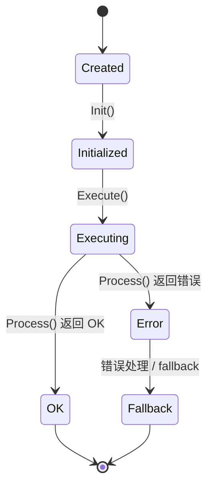

# 第 18 课：新增一个简单 Task

> 学生自学版。先实现一个只记录日志、不改变车辆行为的 Task，用来完整练习插件流程。

## 1. 学习信息

- 预计用时：150～210 分钟。
- 难度：实践。
- 前置：第 17 课。
- 运行环境：Linux + Docker + AEM。
- 代码基线：`d53aa3da47a06a08e6d0cd175d5623a34fa0d6aa`。

## 2. 学完本课应能做到

- [ ] 创建一个最小 Task 类。
- [ ] 注册插件。
- [ ] 编写 `plugins.xml` 和 BUILD。
- [ ] 把 Task 加入 LaneFollow pipeline。
- [ ] 编译并在日志中验证它确实执行。

## 3. 为什么先做日志 Task


直接修改路径或速度很容易让仿真失败。

日志 Task 的目标：

```text
不改变规划结果
只证明插件能被创建、初始化、加载和执行
```

这是新增任何复杂 Task 前最安全的第一步。

## 4. 参考现有 Task 的目录

以 LaneFollowPath 为模板：

```text
modules/planning/tasks/lane_follow_path/
  BUILD
  cyberfile.xml
  plugins.xml
  lane_follow_path.h
  lane_follow_path.cc
  conf/default_conf.pb.txt
  proto/lane_follow_path.proto
```

日志 Task 可以更简单：

```text
modules/planning/tasks/logging_probe/
  BUILD
  cyberfile.xml
  plugins.xml
  logging_probe.h
  logging_probe.cc
```

## 5. 头文件教学示例

```cpp
// 教学位置：modules/planning/tasks/logging_probe/logging_probe.h
// 说明：这是教学示例，不是官方已有文件
#pragma once

#include <memory>
#include <string>

#include "cyber/plugin_manager/plugin_manager.h"
#include "modules/planning/planning_interface_base/task_base/common/decider.h"

namespace apollo {
namespace planning {

// 继承 Decider，因此只需要实现 Process
class LoggingProbe : public Decider {
 public:
  bool Init(const std::string& config_dir, const std::string& name,
            const std::shared_ptr<DependencyInjector>& injector) override;

 private:
  common::Status Process(
      Frame* frame, ReferenceLineInfo* reference_line_info) override;
};

// 注册为 Task 插件，否则配置中的 type 无法创建该对象
CYBER_PLUGIN_MANAGER_REGISTER_PLUGIN(apollo::planning::LoggingProbe, Task)

}  // namespace planning
}  // namespace apollo
```

### 中文注释重点

- `#pragma once`：头文件只展开一次。
- `public Decider`：复用 Decider 的 Execute 生命周期。
- `override`：明确重写父类虚函数。
- `CYBER_PLUGIN...`：把类注册成可加载插件。

## 6. 源文件教学示例

```cpp
// 教学位置：modules/planning/tasks/logging_probe/logging_probe.cc
#include "modules/planning/tasks/logging_probe/logging_probe.h"

#include "cyber/common/log.h"

namespace apollo {
namespace planning {

bool LoggingProbe::Init(
    const std::string& config_dir, const std::string& name,
    const std::shared_ptr<DependencyInjector>& injector) {
  // 必须先调用父类 Init，保存 name、配置路径和 injector
  if (!Decider::Init(config_dir, name, injector)) {
    return false;
  }

  // 当前示例没有专属配置，直接返回成功
  return true;
}

common::Status LoggingProbe::Process(
    Frame* frame, ReferenceLineInfo* reference_line_info) {
  // 防止空指针导致崩溃
  if (frame == nullptr || reference_line_info == nullptr) {
    return common::Status(common::ErrorCode::PLANNING_ERROR,
                          "LoggingProbe received null input");
  }

  // 输出一次日志，用于证明 Task 被 Stage 执行
  AINFO << "[LoggingProbe] Task executed, frame sequence: "
        << frame->SequenceNum();

  // 不修改任何决策，直接返回成功
  return common::Status::OK();
}

}  // namespace planning
}  // namespace apollo
```

## 7. 插件描述

```xml
<!-- 教学位置：modules/planning/tasks/logging_probe/plugins.xml -->
<library path="modules/planning/tasks/logging_probe/liblogging_probe.so">
  <class type="apollo::planning::LoggingProbe"
         base_class="apollo::planning::Task"></class>
</library>
```

作用：

```text
告诉 Cyber：liblogging_probe.so 里导出了 LoggingProbe 插件。
```

## 8. 加入 LaneFollow pipeline

> 参考源码位置：`modules/planning/scenarios/lane_follow/conf/pipeline.pb.txt`。

```text
# 教学改动：在 LaneFollowStage 的任务链中临时加入
task {
  name: "LOGGING_PROBE"
  type: "LoggingProbe"
}
```

建议先放在最简单、最靠前的位置验证初始化，再按真实需求调整顺序。

## 9. BUILD 和 cyberfile 需要做什么

不同 Apollo 版本的构建宏可能不同，不能直接复制一个不匹配的 BUILD。

需要确认：

- 源文件被加入目标。
- `task_base`、Cyber 和公共 Planning 依赖已声明。
- 插件共享库名称与 `plugins.xml` 的 `library path` 一致。
- `cyberfile.xml` 声明包依赖。

最安全的做法：

```text
复制一个结构最简单、已经能编译的 Task
只替换类名、文件名和注册信息
先让最小版本编译通过
```

## 10. 编译和验证

```bash
# 确认依赖和 buildtool
buildtool -v

# 编译 Planning
buildtool build -p modules/planning

# 启动 Apollo 仿真环境
aem bootstrap start --plus
```

在日志中搜索：

```bash
rg "LoggingProbe" /opt/apollo/neo/data/log
```

预期：

```text
[LoggingProbe] Task executed
```

如果没有日志，按顺序检查：

1. Task 是否注册到插件。
2. `plugins.xml` 是否存在。
3. pipeline 是否包含该 Task。
4. 共享库是否编译。
5. 是否运行了旧二进制。
6. 日志级别是否过滤了 `AINFO`。

## 11. 动手实验

完成以下任务：

- [ ] 新建 `logging_probe` 目录。
- [ ] 创建头文件和源文件。
- [ ] 注册插件。
- [ ] 创建 `plugins.xml`。
- [ ] 配置 BUILD 和 cyberfile。
- [ ] 加入 LaneFollow pipeline。
- [ ] 编译并运行。
- [ ] 找到日志。
- [ ] 提交修改文件列表和日志证据。

## 12. 常见错误

- 只写 C++ 类，没有插件注册。
- 只写注册宏，没有 `plugins.xml`。
- `type`、类名和注册名不一致。
- 忘记调用 `Decider::Init`。
- Task 返回值错误，导致后续任务中断。
- 修改了配置却没重启。
- 编译的是另一个工作空间。

## 13. 自测题

1. 为什么先做日志 Task？
2. `LoggingProbe` 为什么继承 Decider？
3. `Process` 需要返回什么类型？
4. 日志验证的核心关键字是什么？
5. `plugins.xml` 的作用是什么？
6. pipeline 配置的 `type` 应该写什么？
7. Init 中为什么先调用父类 Init？
8. 为什么需要检查空指针？
9. 没有日志时至少检查哪五项？
10. 完成本课的最重要证据是什么？

## 14. 参考答案

1. 不改变车辆行为，只验证插件链。
2. 复用 Decider 的 Execute 流程，只需实现 Process。
3. `common::Status`。
4. `[LoggingProbe]`。
5. 声明共享库导出的插件类。
6. `LoggingProbe`。
7. 保存名称、配置路径和依赖注入器。
8. 防止访问空地址导致崩溃。
9. 插件注册、plugins.xml、pipeline、共享库、运行版本/日志级别。
10. 编译成功并在日志中看到 Task 实际执行。

## 15. 过关检查

- [ ] 能独立创建最小 Task 文件。
- [ ] 能注册插件。
- [ ] 能配置 pipeline。
- [ ] 能编译并看到日志。
- [ ] 知道如何回退这次修改。

## 16. 下一课衔接

下一课学习日志、DreamView 和调试流程，把“我改了代码”变成“我能证明代码真的按预期执行”。